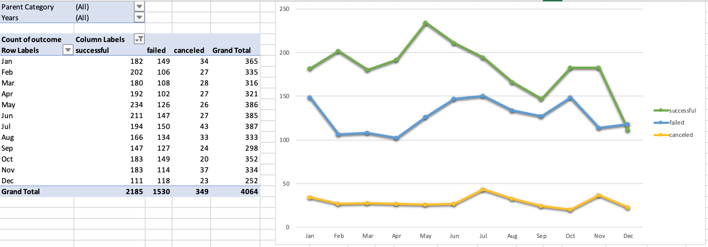

# Excel Analysis

Over $2 billion has been raised using the massively successful crowdfunding service, Kickstarter, but not every project has found success. Of the more than 300,000 projects launched on Kickstarter, only a third have made it through the funding process with a positive outcome.

Getting funded on Kickstarter requires meeting or exceeding the project's initial goal, so many organizations spend months looking through past projects in an attempt to discover some trick for finding success. I organize and analyze a database of 4,000 past projects in order to uncover any hidden trends.

* I used conditional formatting to fill each cell in the `state` column with a different color, depending on whether the associated campaign was successful, failed, or canceled, or is currently live.

* Next I created a new column O called `Percent Funded` that uses a formula to uncover how much money a campaign made to reach its initial goal.

* Using conditional formatting I then filled each cell in the `Percent Funded` column using a three-color scale. The scale starts at 0 and is a dark shade of red, transitioning to green at 100, and blue at 200.

* What followed was creating a new column P called `Average Donation` that uses a formula to uncover how much each backer for the project paid on average.

* Finally, I created two new columns, one called `Category` at Q and another called `Sub-Category` at R, which use formulas to split the `Category and Sub-Category` column into two parts.

- - -
  
 * A new sheet was then created with a pivot table to analyze my initial worksheet to count how many campaigns were successful, failed, canceled, or are currently live per **category**.

 * What ensued was the creation of a stacked column pivot chart that can be filtered by country based on the table I created.
 
 
 
- - -

* Now a new sheet was created with a pivot table analyzing my initial sheet to count how many campaigns were successful, failed, or canceled, or are currently live per **sub-category**.

* A stacked column pivot chart was created that can be filtered by country and parent-category based on the table I created.

* The dates stored within the `deadline` and `launched_at` columns use Unix timestamps. Fortunately, [this formula](https://www.extendoffice.com/documents/excel/2473-excel-timestamp-to-date.html) is used to convert these timestamps to a normal date.

* A new column is created named `Date Created Conversion` that will use [this formula](https://www.extendoffice.com/documents/excel/2473-excel-timestamp-to-date.html) to convert the data contained within `launched_at` into Excel's date format.

* Finally I created a new column named `Date Ended Conversion` that will use [this formula](https://www.extendoffice.com/documents/excel/2473-excel-timestamp-to-date.html) to convert the data contained within `deadline` into Excel's date format.
  
  

- - -

  

  * Create a new sheet with a pivot table with a column of `state`, rows of `Date Created Conversion`, values based on the count of `state`, and filters based on `parent category` and `Years`.

  * Now create a pivot chart line graph that visualizes this new table.

* Create a report in Microsoft Word and answer the following questions.

1. Given the provided data, what are three conclusions we can draw about Kickstarter campaigns?
2. What are some limitations of this dataset?
3. What are some other possible tables and/or graphs that we could create?

- - -

© 2019 Trilogy Education Services
